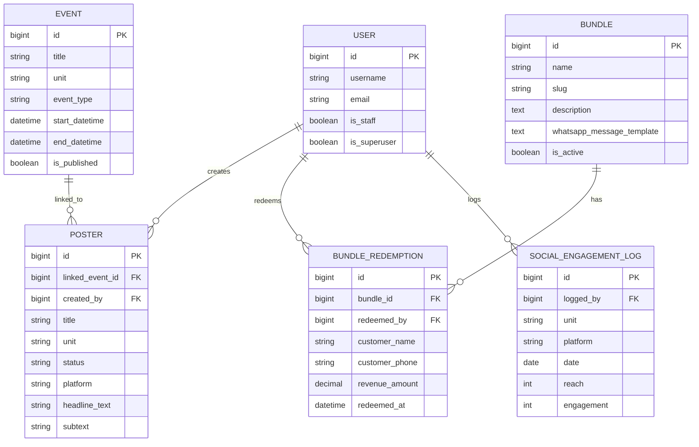

# 109 Tavern Unified Marketing & Web Platform

A data-driven, automated monorepo platform built for **109 Tavern Restaurant, Carwash & Barbershop**. It synchronizes the public-facing brand site with an internal marketing operations hub: automated poster generation, a live event tracker, cross-unit bundle tracking, and bundle-ROI / social-engagement analytics.

## System Architecture Overview

```text
109 TAVERN/
│
├── backend/                # Django REST Framework API (data & analytics)
│   ├── core_api/            # Models, serializers, viewsets, Content Studio (Pillow)
│   └── tavern_core/         # Project settings, root URLs
│
└── frontend/                # React SPA (public portal + admin hub)
    └── src/
        ├── api/              # Axios client + JWT refresh interceptor
        ├── components/       # Layouts, nav, WhatsApp CTA, live event banner
        ├── context/          # Auth context (JWT session)
        └── pages/
            ├── public/       # Home, unit pages, events, bundles
            └── admin/        # Login, dashboard, Content Studio, CRUD screens
```

## Tech Stack

**Backend:** Python 3.12, Django 5.0, Django REST Framework, SimpleJWT, Pillow, psycopg2-binary, django-cors-headers, PostgreSQL, python-decouple (env config)

**Frontend:** Vite + React 19, Tailwind CSS v4, Axios, React Router v7

## Core Product Modules

### Module A — Public Growth Engine (`/`)
- Unified brand portal across Restaurant, Carwash, Barbershop
- **"Happening Tonight"** live banner — auto-populates from any currently-running published `Event`
- Bundles page with 1-click **WhatsApp click-to-chat** booking links
- Per-unit menu/rates + gallery (with before/after pairs for the barbershop)

### Module B — Admin Ops Hub (`/hub`, JWT-protected)
- **Content Studio** — upload a raw photo, add headline/subtext, and Pillow renders a 1080×1080 Instagram/Facebook-ready graphic server-side; publishing links it to an event so the public site updates instantly
- **Content Calendar** — create/publish events (Rhumba, Karaoke, Live Band…)
- **Bundles & Redemptions** — define cross-unit bundles and manually log redemptions for ROI tracking
- **Menus & Rates** and **Gallery** management per unit
- **Social Engagement Log** — manual reach/engagement entries (replaces vanity metrics)
- **Dashboard** — bundle ROI + social trend rollup, with a "Print Monthly Report" button (browser print-to-PDF)

## Local Installation & Setup

### Prerequisites
- Python 3.10+
- Node.js LTS
- PostgreSQL running locally
- Docker and Docker Compose (optional, for the containerized setup)

### Quick Start with Docker
If you prefer the containerized workflow, start the full stack from the repository root:

```bash
docker compose up --build
```

This launches the Django API, React frontend, and PostgreSQL service with the project’s Docker configuration.

### 1. Database
Create a database and, ideally, a dedicated role:

```bash
psql -U postgres -c "CREATE DATABASE tavern109_db;"
psql -U postgres -c "CREATE USER tavern109 WITH PASSWORD 'TAVERN109';"
psql -U postgres -c "GRANT ALL PRIVILEGES ON DATABASE tavern109_db TO tavern109;"
```

### 2. Backend

```bash
cd backend
python3 -m venv venv
source venv/bin/activate        # Windows: venv\Scripts\activate

pip install -r requirements.txt

cp .env.example .env            # then fill in DB_USER / DB_PASSWORD / etc.

python manage.py migrate
python manage.py createsuperuser
python manage.py runserver      # http://127.0.0.1:8000
```

### 3. Frontend

```bash
cd frontend
npm install
cp .env.example .env             # points at the API base URL + WhatsApp number
npm run dev                      # http://localhost:5173
```

## Run Environments

| App Layer | Command | URL |
| :--- | :--- | :--- |
| Django API | `python manage.py runserver` | `http://127.0.0.1:8000` |
| React UI | `npm run dev` | `http://localhost:5173` |
| Django Admin | — | `http://127.0.0.1:8000/admin/` |

## API Surface (`/api/`)

| Endpoint | Notes |
| :--- | :--- |
| `POST /api/auth/token/`, `/api/auth/token/refresh/` | JWT login (SimpleJWT) |
| `/api/offerings/` | Menu items, carwash rates, barbershop packages — public read, staff write |
| `/api/events/`, `/api/events/happening_now/` | Public read (published only), staff write |
| `/api/bundles/` (lookup by `slug`) | Public read (active only), staff write |
| `/api/redemptions/` | Staff-only — bundle redemption logging |
| `/api/gallery/` | Public read, staff write; supports `before_image` / `after_image` |
| `/api/posters/`, `.../{id}/generate/`, `.../{id}/publish/` | Staff-only — Content Studio |
| `/api/social-logs/` | Staff-only — manual engagement entries |
| `/api/analytics/summary/` | Staff-only — bundle ROI + social rollup for the dashboard |

## Security Notes

- JWT access tokens last 8 hours, refresh tokens 7 days, stored client-side in `localStorage` with an Axios interceptor that auto-refreshes on 401.
- CORS is restricted to the origins in `CORS_ALLOWED_ORIGINS` (defaults to the Vite dev server).
- `.env` files are git-ignored; only `.env.example` is committed. Rotate `DJANGO_SECRET_KEY` and the DB password before deploying.

## Deployment Targets

- **Backend:** Render or Railway (set `DJANGO_DEBUG=False`, real `DJANGO_ALLOWED_HOSTS`, managed Postgres)
- **Frontend:** Vercel or Netlify (set `VITE_API_BASE_URL` to the deployed API)

## Database Diagram



## Container & Deployment Specification

The repository now includes a deployment-oriented implementation spec in [docs/project-spec.md](docs/project-spec.md), plus Docker and CI/CD scaffolding for the three major layers:

- `docker-compose.yml` for frontend, backend, and PostgreSQL
- `backend/Dockerfile` and `frontend/Dockerfile`
- `.github/workflows/deploy.yml` for backend and frontend deployment automation
