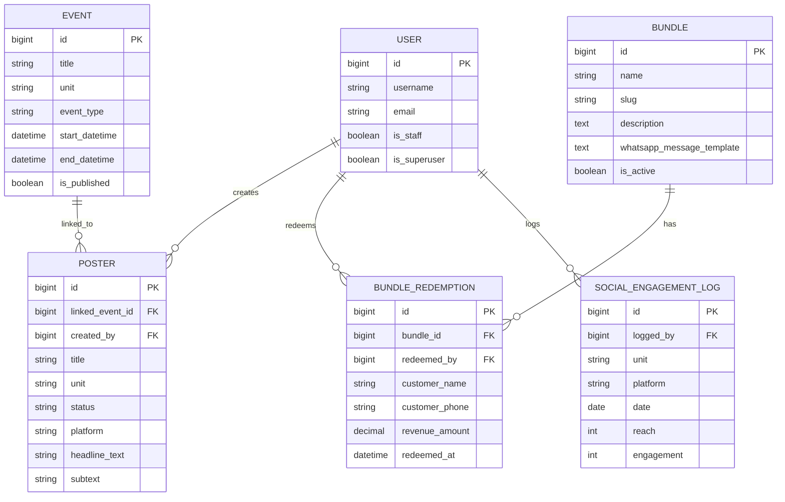

# 109 Tavern – Project Implementation Specification

## 1. Authentication / Authorization

The platform uses Django’s built-in authentication with JWT for staff access.

- Public consumers can read content endpoints without being authenticated.
- Staff users authenticate through `POST /api/auth/token/` and refresh through `POST /api/auth/token/refresh/`.
- The frontend stores access and refresh tokens in `localStorage` and refreshes automatically on HTTP 401.
- Authorization rules:
  - `Offering`, `Event`, `Bundle`, and `GalleryImage` use the `IsStaffOrReadOnly` policy.
  - `Poster`, `SocialEngagementLog`, and `AnalyticsSummaryView` require an authenticated user.
  - `BundleRedemptionViewSet` requires authentication and records `redeemed_by` automatically from the requesting user.
  - `Poster` and `SocialEngagementLog` set ownership metadata automatically using `created_by` and `logged_by`.

Recommended future hardening:

- Introduce role-based permissions (`staff`, `admin`, `content_manager`) instead of relying only on `is_staff`.
- Add object-level rules so only the owner or a superuser can edit certain records.

## 2. Django REST API

The API is built on Django REST Framework with a default router and viewsets.

Base path:

- `/api/`

Primary resource routers:

- `/api/offerings/`
- `/api/events/`
- `/api/bundles/`
- `/api/redemptions/`
- `/api/gallery/`
- `/api/posters/`
- `/api/social-logs/`
- `/api/analytics/summary/`

Behavior:

- Public read access is allowed for the published content endpoints.
- Staff-only write access is enforced where needed.
- `EventViewSet` exposes a custom `happening_now` action.
- `PosterViewSet` exposes custom `generate` and `publish` actions.
- Pagination is enabled with `PageNumberPagination`.

## 3. Five Core Schemas

These are the five primary schemas used by the product surface.

### 1. Offering

Represents a sellable menu or service item.

Fields:

- `unit`
- `category`
- `name`
- `description`
- `price`
- `image`
- `is_available`
- `display_order`

### 2. Event

Represents a time-bound promotional or live activity.

Fields:

- `title`
- `unit`
- `event_type`
- `description`
- `banner_image`
- `start_datetime`
- `end_datetime`
- `is_published`

### 3. Bundle

Represents a multi-unit offer that can be promoted publicly.

Fields:

- `name`
- `slug`
- `description`
- `units_included[]`
- `price`
- `discount_label`
- `image`
- `whatsapp_message_template`
- `is_active`

### 4. GalleryImage

Represents a before/after or marketing photo collection item.

Fields:

- `unit`
- `title`
- `caption`
- `image`
- `before_image`
- `after_image`
- `is_featured`
- `display_order`

### 5. Poster

Represents a content-studio asset whose image is generated and optionally published.

Fields:

- `title`
- `unit`
- `base_image`
- `headline_text`
- `subtext`
- `generated_image`
- `platform`
- `status`
- `linked_event`
- `created_by`
- `published_at`

Supporting operational schemas already present in the repo:

- `BundleRedemption`
- `SocialEngagementLog`

## 4. Dockerization

Docker will be used to standardize local development and deployment for all three major layers.

### Services

- `frontend`: React + Vite production build, served with Nginx.
- `backend`: Django API served with Gunicorn.
- `db`: PostgreSQL 16 instance.

### Local compose flow

```bash
docker compose up --build
```

Expected ports:

- Frontend: `http://localhost:5173`
- Backend: `http://localhost:8000`
- Database: `localhost:5432`

## 5. GitHub Actions Deployment

A deployment workflow should run on pushes into `main` and allow manual dispatch.

Recommended jobs:

1. `backend-test`
   - install Python requirements
   - apply Django migrations
   - run the Django test suite

2. `frontend-build`
   - install Node dependencies
   - run `npm run build`

3. `deploy-backend`
   - trigger deployment hook for Render / Railway / your chosen backend host

4. `deploy-frontend`
   - deploy the built frontend to Vercel / Netlify

Environment secrets that should be configured in GitHub:

- `DJANGO_SECRET_KEY`
- `DB_NAME`
- `DB_USER`
- `DB_PASSWORD`
- `DB_HOST`
- `RENDER_DEPLOY_HOOK`
- `VERCEL_TOKEN`
- `VERCEL_ORG_ID`
- `VERCEL_PROJECT_ID`

## 6. Database Diagram


